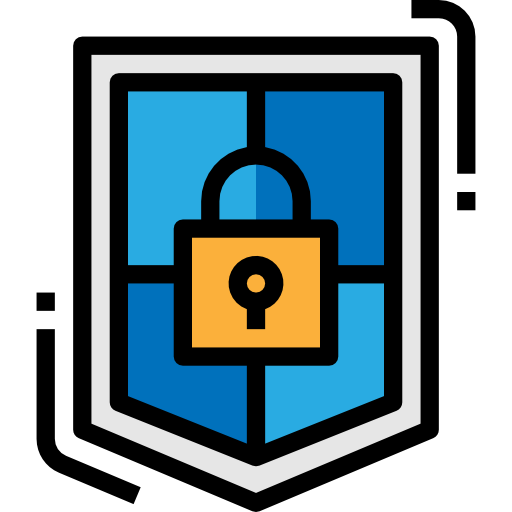
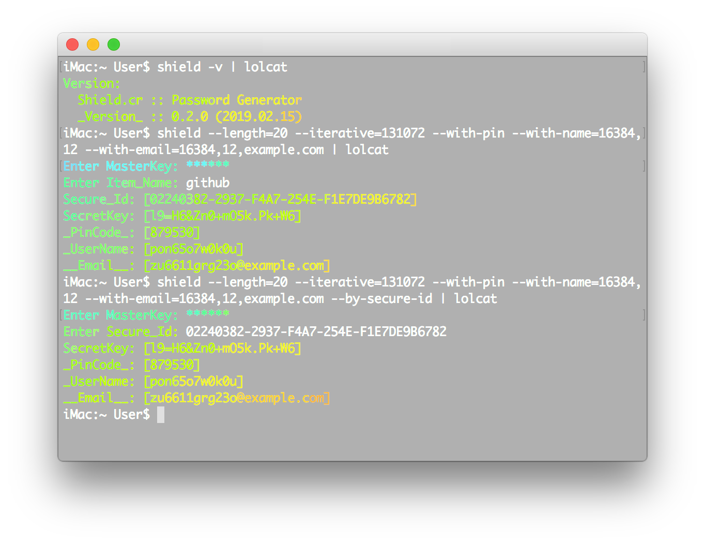

<div align = "center"></div>

<div align = "center">
  <h1>Shield.cr - Password Generator</h1>
</div>

<p align="center">
  <a href="https://crystal-lang.org">
    </a>
  <a href="https://travis-ci.org/636f7374/shield.cr">
    </a>
  <a href="https://github.com/636f7374/shield.cr/releases">
    </a>
  <a href="https://github.com/636f7374/shield.cr/blob/master/license">
  	</a>
</p>

<div align = "center"><a href=""></a></div>

## Description

* This is the first tool I made while learning the Crystal language. ( ≈ 1 year ago )
  * This is very different from my current idea, I will rewrite it in the future.
    * Use `Base64` stream instead of offset (English uppercase / lowercase).
    * Better structure, clear syntax, ...
* In the future, once I have free time, I may rewrite it using Rust, and port to `WebAssembly`.
* Due to the need to maintain other Crystal repositories, this project will be temporarily put on hold.
  * **Currently, this repository is non-first priority, `2020-03-29 16:38:37.932649000 UTC`.**


## Summary

* Use multiple [Cryptographic hash function](https://en.wikipedia.org/wiki/Cryptographic_hash_function).
* Based on the `Char` (Unicode) offset character.
* Slide to adjust the secret key length.
* Confound the results of password.
* Create an indestructible password.
* create more (e.g. email, user_name, pin).
* Shield generates [One-way security password.](https://en.wikipedia.org/wiki/One-way_compression_function)
* Shield.cr will never save any data.

### Features

* [X] Specify the Number of Iterations.
* [X] Specify the Length of SecretKey (Between 10 to 99).
* [X] Create Email / UserName / PIN Code.
* [X] Sliding to Create Secret Key.
* [X] Enable / Disable the Secret Key symbol Feature.

### RoadMap

* [ ] More Code Comments to be added.
* [X] More Spec Tests to be added.
* [ ] More Wiki Information to be added.
* [X] Shield CLI Password Vault ([Shadow.cr](https://github.com/636f7374/shadow.cr)).
* [ ] Shield.cr Windows / iOS Support.
* [ ] ...

## IdWithKey

### How does it work?

* SecureId
  * UUID-Sha384
* SecretKey
  * (sha512WithRSAEncryption + HMAC + (Pbkdf2HMAC \* 32)) * iterations

### SecureId

* \_id\_: OpenSSL#Digest
  * Digest(data: titleName, "sha384")
  * left, right = getCenter
  * [left..right] -> UUID -> UpCase

### SecretKey

* \_rsa\_: OpenSSL#Digest
  * Digest(data: key, algorithm: sha512WithRSAEncryption) + : + SecureId
  * Slide
* \_hmac: OpenSSL#HMAC
  * SecureId + : + HMAC(data: \_rsa\_, key: Crc32(\_rsa\_).reverse)
* pbkdf: OpenSSL#PKCS5#Pbkdf2HMAC
  * Pbkdf2HMAC(secret: \_hmac, salt: \_rsa\_, iterations: 2 ** 5, algorithm: SHA512)
  * Slide
* \_key\_: Shield#Character#obfuscate
  * Obfuscate(pbkdf[PbkdfSlider.left..PbkdfSlider.right].reverse)
  * ...
* IterativeKey(iterations) -> Done -> yield done?, \_key\_.

## Use Shield

### Used as Shard

Add this to your application's shard.yml:

```yaml
dependencies:
  shield:
    github: 636f7374/shield.cr
```

### Installation

```bash
$ git clone https://github.com/636f7374/shield.cr.git
$ cd shield.cr && make build && make install
```

## Development

```bash
$ make test
```

## Credit

* [\_Icon::categories/security](https://www.flaticon.com/packs/security-62)
* [Shard::crystal-lang/crystal-readline](https://github.com/crystal-lang/crystal-readline)

## Contributors

|Name|Creator|Maintainer|Contributor|
|:---:|:---:|:---:|:---:|
|**[636f7374](https://github.com/636f7374)**|√|√||
|**[delef](https://github.com/delef)**|||√|

## License

* MIT License
